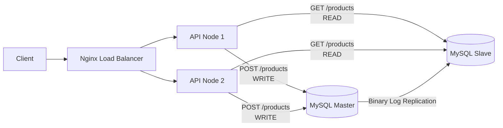

# System Architecture Diagram

## Notes
- Nginx is the single entry point and distributes traffic to both API nodes.
- `POST /products` always writes to Master.
- `GET /products` always reads from Slave.
- `processed_by` in API response proves load-balancing behavior.